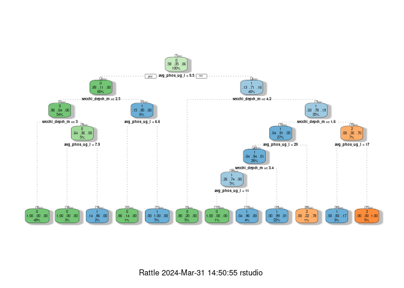
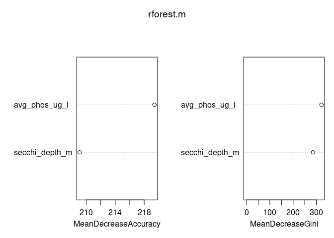

testing
================
Joshua Crisologo: 1009860438
2024-03-31

``` r
# filtering data and lakes to most recent date of test
 df = data %>% 
      group_by(Lake.Name) %>%
      filter(phos_date==max(phos_date)) %>%
      filter(trans_date==max(trans_date))
```

``` r
t.test(df$avg_phos_ug_l)
```

    ## 
    ##  One Sample t-test
    ## 
    ## data:  df$avg_phos_ug_l
    ## t = 34.777, df = 1169, p-value < 2.2e-16
    ## alternative hypothesis: true mean is not equal to 0
    ## 95 percent confidence interval:
    ##  10.21926 11.44126
    ## sample estimates:
    ## mean of x 
    ##  10.83026

``` r
boot_function = function() {
  boot_data = df[sample(nrow(df), replace = TRUE), ]
  
  boot_mean = mean(boot_data$avg_phos_ug_l, na.rm = TRUE)
  
  return(boot_mean)
}

quantile(replicate(100,boot_function()), c(0.025, 0.975))
```

    ##     2.5%    97.5% 
    ## 10.33518 11.48653

jj

``` r
df = df %>% mutate(TSI_Depth = (60 - 14.41*log(secchi_depth_m))) %>% 
  mutate(TSI_Phos = (14.42*log(avg_phos_ug_l) + 4.15)) %>% 
  mutate(TSI = ((TSI_Depth + TSI_Phos) / 2)) %>% 
  mutate(classification = case_when(TSI <= 40 ~ "0",
                                    TSI <= 50 ~ "1",
                                    TRUE ~ "2"))

# 0 = oligotrophic
# 1 = mesotrophic
# 2 = eutrophic
df_rm = df %>% drop_na()
```

``` r
final = df_rm
final = final %>% mutate(group_ind = sample(c("train", "test"),
                                            size=1,
                                            prob = c(0.6, 0.4),
                                            replace = T))

final_train = final %>% filter(group_ind == "train")
final_test = final %>% filter(group_ind == "test")
library(rpart)
library(rattle)
```

    ## Loading required package: bitops

    ## Rattle: A free graphical interface for data science with R.
    ## Version 5.5.1 Copyright (c) 2006-2021 Togaware Pty Ltd.
    ## Type 'rattle()' to shake, rattle, and roll your data.

``` r
tree.m = rpart(classification ~ avg_phos_ug_l + secchi_depth_m, data = final_train,
               method = "class")
fancyRpartPlot(tree.m)
```

<!-- -->

``` r
library(randomForest)
```

    ## randomForest 4.7-1.1

    ## Type rfNews() to see new features/changes/bug fixes.

    ## 
    ## Attaching package: 'randomForest'

    ## The following object is masked from 'package:rattle':
    ## 
    ##     importance

    ## The following object is masked from 'package:dplyr':
    ## 
    ##     combine

    ## The following object is masked from 'package:ggplot2':
    ## 
    ##     margin

``` r
rforest.m = randomForest(as.factor(classification) ~ avg_phos_ug_l + secchi_depth_m, data=df_rm,
                         ntree=500, importance=TRUE)
```

``` r
varImpPlot(rforest.m)
```

<!-- -->

``` r
final_test = final_test %>% ungroup(.) %>% mutate(tree_predictions = 
                                        predict(tree.m, newdata = final_test, type = "class"))

# Predictions using the random forest model

final_test = final_test %>% mutate(rforest_predict = 
                                        predict(rforest.m, newdata = final_test))

glimpse(final_test)
```

    ## Rows: 481
    ## Columns: 19
    ## $ lat              <int> 432844, 432955, 433827, 434143, 435755, 440050, 44095…
    ## $ long             <int> 803806, 803939, 792758, 802646, 804843, 774233, 81030…
    ## $ STN              <int> 7597, 7697, 7065, 7110, 205, 7103, 7170, 6922, 6999, …
    ## $ Site.ID          <int> 1, 2, 3, 3, 1, 6, 1, 12, 1, 2, 1, 1, 1, 6, 1, 4, 1, 1…
    ## $ Township         <chr> "WILMOT", "", "TORONTO", "PUSLINCH", "MINTO", "HILLIE…
    ## $ Lake.Name        <chr> "SUNFISH LAKE", "PARADISE LAKE", "GRENADIER POND", "P…
    ## $ Site.Description <chr> "Mid Lake, Deep Spot", "middle of lake, deep spot", "…
    ## $ avg_phos_ug_l    <dbl> 11.5, 11.4, 117.0, 17.5, 24.3, 12.7, 11.8, 48.0, 20.3…
    ## $ phos_is_outlier  <chr> "No", "No", "No", "No", "No", "No", "No", "No", "No",…
    ## $ phos_date        <date> 2022-11-17, 2022-10-21, 2019-09-30, 2018-06-03, 2019…
    ## $ secchi_depth_m   <dbl> 3.6, 4.2, 0.8, 1.5, 4.5, 2.1, 5.2, 0.6, 4.6, 3.0, 6.0…
    ## $ trans_date       <date> 2018-11-11, 2022-11-02, 2019-09-30, 2018-07-29, 2017…
    ## $ TSI_Depth        <dbl> 41.54174, 39.32043, 63.21550, 54.15725, 38.32624, 49.…
    ## $ TSI_Phos         <dbl> 39.36864, 39.24270, 72.82055, 45.42294, 50.15667, 40.…
    ## $ TSI              <dbl> 40.45519, 39.28157, 68.01802, 49.79009, 44.24146, 45.…
    ## $ classification   <chr> "1", "0", "2", "1", "1", "1", "0", "2", "1", "0", "0"…
    ## $ group_ind        <chr> "test", "test", "test", "test", "test", "test", "test…
    ## $ tree_predictions <fct> 1, 0, 2, 2, 0, 1, 0, 2, 0, 0, 0, 0, 1, 2, 0, 1, 0, 0,…
    ## $ rforest_predict  <fct> 1, 0, 2, 1, 1, 1, 0, 2, 1, 0, 0, 0, 1, 2, 0, 1, 0, 0,…

``` r
conmat = table(final_test$classification, final_test$tree_predictions)
sum(diag(conmat))/sum(conmat)
```

    ## [1] 0.9438669

``` r
conmat = table(final_test$classification, final_test$rforest_predict)
sum(diag(conmat))/sum(conmat)
```

    ## [1] 1
